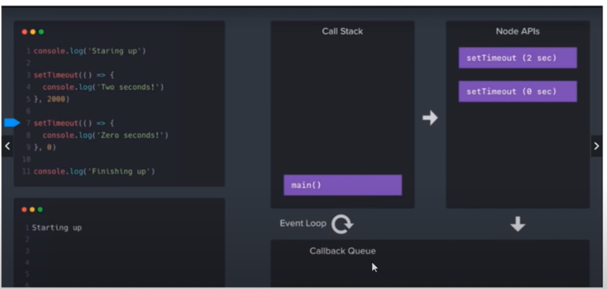

# How Node Works

1. Call Stack
2. Node API
3. CallBack Queue
4. Event Loop
5. Example

```js
console.log("starting up")
setTimeout(() => {
    console.log("2 second log")
}, 2000)
setTimeout(() => {
    console.log("0 second log")
}, 0) // even it's delay time is 0, it doesn't execute instantly ? [Note - 01]
console.log("finishing up")

// Output:
/*
Starting up
finishing up
0 second log
2 second log
*/

```

do watch this video to understand

https://www.youtube.com/watch?v=VrQgmNY96wo&t=18907s


# Notes

[Note-01]: 
- Node js is writen using JavaScript, c, C++;
- setTimeout() derived/inherited from c++ ; 
- inherit methods transfered to Node API section to execute it in background;  

